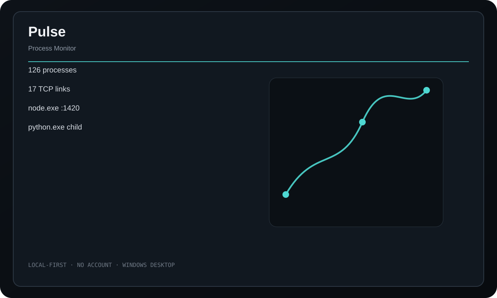

<div align="center">
  
  <h1>Pulse</h1>
  <p><strong>A local process and network relationship monitor that shows not just what is running, but what is connected to what.</strong></p>
  <p>
    <a href="https://github.com/purysho/Pulse/actions/workflows/ci.yml"></a>
    <a href="https://github.com/purysho/Pulse/releases"></a>
    <a href="LICENSE"></a>
  </p>
  <p><a href="https://github.com/purysho/Pulse/releases"><strong>Download for Windows</strong></a> · <a href="#run-from-source">Run from source</a> · <a href="https://github.com/purysho/Pulse/issues">Report an issue</a></p>
</div>



## What it does

- Process list with PID, parent PID, memory, and CPU time
- Filter by process name, PID, path, or command line
- Parent/child relationship view
- Listening and established TCP links where supported
- Configurable automatic refresh
- JSON snapshot export

## Download

Tagged releases are built on `windows-latest` by GitHub Actions. Each release contains `Pulse.exe` and `Pulse.exe.sha256`. The executable is produced from the source at that tag with PyInstaller.

> Until the first tagged release is published, the latest Windows build is available as the **Pulse-windows** artifact on successful CI runs.

## Run from source

Requirements: Python 3.10+ with Tk support.

```powershell
pyw pulse_desktop.pyw
```

The application uses Python's standard library at runtime.

## Build a standalone Windows executable

```powershell
powershell -ExecutionPolicy Bypass -File .\build-windows.ps1
```

Output:

```text
dist\Pulse.exe
```

## Privacy

Pulse collects local operating-system process/network information only. It has no account, backend, telemetry, or remote agent.

## Scope

Windows has the richest provider through built-in PowerShell/CIM. Linux uses /proc plus ss when available; macOS falls back to ps-based discovery. The app never elevates itself.

## Release process

- Every push runs tests/compile checks and builds a Windows executable artifact.
- Tags matching `v*` build the executable again, compute SHA256, and publish both files to GitHub Releases.
- See [CHANGELOG.md](CHANGELOG.md) for release history.

## License

MIT
